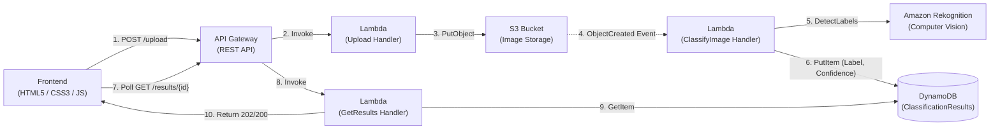

# Serverless Image Classifier

An end-to-end, production-ready serverless image classification application built on AWS. Users can upload images via a responsive web frontend, which triggers asynchronous machine learning inference using Amazon Rekognition, stores metadata and classification labels in Amazon DynamoDB, and delivers results in real time through an Amazon API Gateway REST API.

---

## Architecture Diagram

The architecture follows a decoupled, event-driven pattern connecting the browser client to cloud-native AWS services:



For a comprehensive breakdown of component responsibilities, security models, and sequence workflows, see [docs/architecture.md](docs/architecture.md).

---

## Tech Stack

- **Compute**: AWS Lambda (Python 3.12 runtimes, x86_64 architecture)
- **API Management**: Amazon API Gateway (REST API with CORS support)
- **Object Storage**: Amazon S3 (Encrypted image storage with bucket event notifications)
- **Database**: Amazon DynamoDB (`ClassificationResults` table, On-Demand `PAY_PER_REQUEST` capacity)
- **Computer Vision**: Amazon Rekognition (`DetectLabels` machine learning API)
- **Infrastructure as Code (IaC)**: AWS Serverless Application Model (AWS SAM / CloudFormation)
- **Frontend**: Semantic HTML5, Vanilla CSS3 (Modern White & Blue theme, responsive), Vanilla JavaScript
- **Testing & Tooling**: `pytest`, `moto` (mocking S3, DynamoDB, Rekognition), Python 3.12, AWS CLI, SAM CLI

---

## How It Works

The system implements an asynchronous, event-driven pipeline matching the actual codebase:

1. **Image Selection & Upload (`POST /upload`)**:
   - The user selects or drags-and-drops an image (`.jpg`, `.jpeg`, `.png`) into the frontend dropzone.
   - The frontend converts the image to a base64 DataURL and sends an HTTP POST request to the `/upload` API Gateway endpoint.
   - The [`UploadFunction`](backend/api/upload/app.py) Lambda decodes the base64 payload, validates magic bytes to identify the image type, generates a unique UUID v4 as the image key, and writes the binary file to Amazon S3.
   - The function returns immediately with `{ "imageId": "<uuid>", "message": "Image uploaded successfully" }` and HTTP 200.

2. **Automated Event-Driven Classification**:
   - The arrival of the object in S3 triggers an `s3:ObjectCreated:*` event notification.
   - The [`ClassifyImageFunction`](backend/classify_image/app.py) Lambda receives the event, extracts the bucket and key, and calls Amazon Rekognition's `DetectLabels` API.
   - The function extracts the top predicted label, rounds the confidence score to two decimal places, and persists the record into the DynamoDB `ClassificationResults` table:
     ```json
     {
       "imageId": "efe4998c-f191-4f34-8696-f712e87abe8c",
       "label": "Golden Retriever",
       "confidence": 98.7,
       "s3Key": "efe4998c-f191-4f34-8696-f712e87abe8c",
       "timestamp": "2026-09-22T10:05:47.850126+00:00"
     }
     ```

3. **Client Polling & Result Display (`GET /results/{imageId}`)**:
   - Immediately after uploading, the frontend displays a loading spinner and polls `GET /results/{imageId}` every 2 seconds (`POLL_INTERVAL_MS = 2000`).
   - The [`GetResultsFunction`](backend/api/get_result/app.py) queries DynamoDB by `imageId`:
     - If the item is not yet written, it responds with **HTTP 202 Accepted** (`{"status": "processing"}`), keeping the frontend in a loading state.
     - Once the item is present, it serializes DynamoDB numeric `Decimal` values to standard floats and returns **HTTP 200 OK** with the complete classification payload.
   - The frontend renders the uploaded image thumbnail alongside the predicted label, an animated confidence meter, and metadata.

---

## Step-by-Step Setup & Deployment Instructions

### Prerequisites
1. **Python 3.12** (or 3.11)
2. **AWS SAM CLI** (`sam --version` >= 1.100)
3. **AWS CLI** configured with deployment credentials (`aws configure`)

---

### Local Development & Testing

#### 1. Setup Virtual Environment
```bash
# Clone the repository
git clone https://github.com/pateldhvani20/serverless-image-classifier.git
cd serverless-image-classifier

# Create and activate Python virtual environment
python -m venv backend/.venv

# On Linux / macOS:
source backend/.venv/bin/activate
# On Windows PowerShell:
.\backend\.venv\Scripts\Activate.ps1

# Install dependencies
pip install boto3 moto pytest
```

#### 2. Run Automated Unit Tests (24 Tests)
Run unit tests with mocked AWS services (`moto`):
```bash
pytest backend/tests -v
```

#### 3. Run the End-to-End Verification Script
Run the automated end-to-end verification script to validate upload, asynchronous event processing, DynamoDB storage, and result polling:
```bash
python scripts/verify_e2e.py
```

#### 4. Launch the Local Web UI
Start the local server which serves the frontend and executes the Lambda handlers:
```bash
python scripts/dev_server.py
```
Open `http://127.0.0.1:3000` in your web browser. Drag and drop any image to see the upload, 2-second polling, and results display in action.

---

### AWS Cloud Deployment

#### 1. Build the SAM Project
Package all Lambda dependencies and SAM templates:
```bash
sam build -t infrastructure/template.yaml
```

#### 2. Deploy to AWS (Guided)
Deploy the CloudFormation stack to your AWS account:
```bash
sam deploy --guided
```
Provide the following parameters when prompted:
- **Stack Name**: `image-classifier-stack`
- **AWS Region**: `us-east-1` (or your preferred AWS region)
- **Confirm changes before deploy**: `Y`
- **Allow SAM CLI IAM role creation**: `Y`
- **Disable authorization confirmation for API**: `Y`
- **Save arguments to configuration file**: `Y`

#### 3. Connect Frontend to the Cloud API
Once deployment completes, note the `ApiEndpoint` output from CloudFormation:
```
Key                 ApiEndpoint
Description         API Gateway endpoint URL (dev stage)
Value               https://<api-id>.execute-api.us-east-1.amazonaws.com/dev/
```
Update `frontend/app.js` with your deployed URL:
```javascript
const API_BASE_URL = "https://<api-id>.execute-api.us-east-1.amazonaws.com/dev";
```
Or create a `.env` file based on `.env.example`:
```bash
cp .env.example .env
```

---

## Live Verification & Monitoring

### 1. Test via curl
```bash
API_URL="https://<api-id>.execute-api.us-east-1.amazonaws.com/dev"

# Upload an image
IMAGE_B64=$(base64 -w 0 path/to/image.jpg)
UPLOAD_RES=$(curl -s -X POST "$API_URL/upload" \
  -H "Content-Type: application/json" \
  -d "{\"image\": \"$IMAGE_B64\"}")
echo "Upload Result: $UPLOAD_RES"

# Extract generated imageId
IMAGE_ID=$(echo $UPLOAD_RES | grep -o '"imageId":"[^"]*' | cut -d'"' -f4)

# Retrieve classification result
curl -s -X GET "$API_URL/results/$IMAGE_ID"
```

### 2. Inspect CloudWatch Logs
Tail Lambda logs in real time:
```bash
# Upload handler logs
sam logs -n UploadFunction --stack-name image-classifier-stack --tail

# Classification handler logs
sam logs -n ClassifyImageFunction --stack-name image-classifier-stack --tail

# Results retrieval logs
sam logs -n GetResultsFunction --stack-name image-classifier-stack --tail
```

### 3. Verify DynamoDB Persistence
Query the DynamoDB table to inspect saved items:
```bash
aws dynamodb scan --table-name ClassificationResults --region us-east-1
```

---

## Teardown & Cost Avoidance

> [!WARNING]
> To prevent unexpected storage or API charges on AWS, always tear down the CloudFormation stack when testing is complete.

CloudFormation requires S3 buckets to be completely empty before deleting them. Safe automated teardown scripts are provided:

### Automated Teardown Script

#### Linux / macOS / Git Bash:
```bash
chmod +x scripts/destroy.sh
./scripts/destroy.sh image-classifier-stack us-east-1
```

#### Windows PowerShell:
```powershell
.\scripts\destroy.ps1 -StackName image-classifier-stack -Region us-east-1
```

The script automatically locates the stack's S3 bucket, deletes all contained objects and versions, and invokes `sam delete --no-prompts` to delete all API Gateway, Lambda, DynamoDB, and IAM resources.

---

## License

This project is licensed under the MIT License — see the [LICENSE](LICENSE) file for details.
