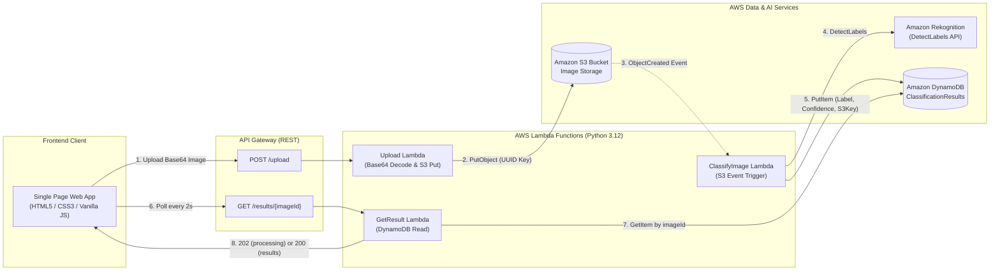

# Serverless Image Classifier

An end-to-end, production-ready AWS Serverless image classification platform. Images uploaded via a modern web interface are stored in Amazon S3, classified asynchronously using Amazon Rekognition, persisted to Amazon DynamoDB, and served through a low-latency REST API Gateway.

---

## Architecture



### Event-Driven Pipeline Flow
1. **Upload Request**: The browser client uploads an image (JPEG/PNG) as base64 to `POST /upload`.
2. **Storage**: The `UploadFunction` decodes the image binary and stores it into the S3 bucket using a generated UUID as the key. It immediately returns `{ "imageId": "<uuid>" }` with HTTP 200.
3. **Asynchronous Trigger**: S3 automatically fires an `s3:ObjectCreated:*` event notification that triggers `ClassifyImageFunction`.
4. **AI Inference**: The classification Lambda invokes Amazon Rekognition's `DetectLabels` API to analyze the image, extracting the top classification label and confidence score.
5. **Persistence**: The classification result (`imageId`, `label`, `confidence`, `s3Key`, `timestamp`) is persisted to the DynamoDB `ClassificationResults` table.
6. **Real-Time Polling**: The frontend polls `GET /results/{imageId}` every 2 seconds. The `GetResultsFunction` responds with `202 Accepted` while processing, and `200 OK` once the DynamoDB item is ready, displaying the thumbnail, predicted label, and confidence gauge.

---

## Tech Stack

| Layer | Technologies |
| :--- | :--- |
| **Compute** | AWS Lambda (Python 3.12, x86_64, AWS SAM) |
| **API** | Amazon API Gateway (REST API, CORS enabled) |
| **Storage** | Amazon S3 (Encrypted object storage, event notifications) |
| **Database** | Amazon DynamoDB (`ClassificationResults`, Pay-Per-Request billing) |
| **Machine Learning** | Amazon Rekognition (`DetectLabels` computer vision API) |
| **Frontend** | Semantic HTML5, Vanilla CSS3 (White & Blue theme), JavaScript (Fetch, FileReader) |
| **IaC** | AWS Serverless Application Model (SAM / CloudFormation) |
| **Testing** | `pytest`, `moto` (mocking S3, DynamoDB, and Rekognition), `curl` |

---

## Project Structure

```
serverless-image-classifier/
├── backend/
│   ├── api/
│   │   ├── upload/
│   │   │   ├── app.py              # POST /upload Lambda handler
│   │   │   └── requirements.txt
│   │   └── get_result/
│   │       ├── app.py              # GET /results/{imageId} Lambda handler
│   │       └── requirements.txt
│   ├── classify_image/
│   │   ├── app.py                  # S3-triggered Rekognition Lambda handler
│   │   └── requirements.txt
│   └── tests/
│       ├── test_api.py             # 14 unit tests for API endpoints (moto)
│       ├── test_classify_image.py  # 10 unit tests for classification pipeline
│       └── local_server.py         # Mock HTTP server for curl testing
├── frontend/
│   ├── index.html                  # Single-page UI with drag-and-drop
│   ├── style.css                   # Modern White & Blue design system
│   └── app.js                      # Upload handling and 2-second polling logic
├── infrastructure/
│   └── template.yaml               # AWS SAM template (all cloud resources & IAM policies)
├── scripts/
│   ├── dev_server.py               # Local development server with simulated pipeline
│   ├── verify_e2e.py               # Full end-to-end automated verification script
│   ├── destroy.sh                  # Safe Bash stack teardown (empties S3 first)
│   └── destroy.ps1                 # Safe PowerShell stack teardown
├── .env.example                    # Template environment variables
└── README.md                       # Comprehensive project documentation
```

---

## Setup & Local Testing

### Prerequisites
- Python 3.11 or 3.12
- [AWS SAM CLI](https://docs.aws.amazon.com/serverless-application-model/latest/developerguide/install-sam-cli.html) (`sam --version >= 1.100`)
- [AWS CLI](https://aws.amazon.com/cli/) (configured with valid AWS credentials for cloud deployment)

### 1. Run Unit Tests (24 Tests)
```bash
# Activate python virtual environment
python -m venv backend/.venv
source backend/.venv/bin/activate  # Or on Windows: backend\.venv\Scripts\activate

# Install dependencies
pip install boto3 moto pytest

# Run all test suites
pytest backend/tests -v
```

### 2. Run Automated End-to-End Verification Pass
```bash
python scripts/verify_e2e.py
```
This runs an end-to-end verification pass that exercises the upload handler, queries the pending 202 status, simulates S3-event classification, checks result retrieval (200), confirms DynamoDB persistence, and validates structured logging.

### 3. Run the Frontend Locally
```bash
python scripts/dev_server.py
```
Navigate to `http://127.0.0.1:3000` in any web browser to test drag-and-drop uploads, active polling, and visual classification results.

---

## AWS Deployment Guide

### 1. Configure AWS Credentials
Ensure your local terminal has active AWS credentials:
```bash
aws configure
# or export environment variables:
export AWS_ACCESS_KEY_ID="your-access-key"
export AWS_SECRET_ACCESS_KEY="your-secret-key"
export AWS_DEFAULT_REGION="us-east-1"
```

### 2. Build the Application
Compile all Lambda dependencies and packages:
```bash
sam build -t infrastructure/template.yaml
```

### 3. Deploy Stack (Guided)
Deploy to your AWS account using guided prompts:
```bash
sam deploy --guided
```
When prompted:
- **Stack Name**: `image-classifier-stack`
- **AWS Region**: `us-east-1` (or your preferred region)
- **Confirm changes before deploy**: `Y`
- **Allow SAM CLI IAM role creation**: `Y`
- **Disable authorization confirmation for API**: `Y` (public demo endpoints)
- **Save arguments to configuration file**: `Y`

### 4. Configure the Frontend
Once deployed, SAM outputs the API base URL:
```
Key                 ApiEndpoint
Description         API Gateway endpoint URL (dev stage)
Value               https://<api-id>.execute-api.us-east-1.amazonaws.com/dev/
```
Copy this URL into `frontend/app.js`:
```javascript
const API_BASE_URL = "https://<api-id>.execute-api.us-east-1.amazonaws.com/dev";
```
Or create a `.env` file from `.env.example`.

---

## Verification on AWS

### 1. Test via curl
```bash
API_URL="https://<api-id>.execute-api.us-east-1.amazonaws.com/dev"

# 1. Upload an image
IMAGE_B64=$(base64 -w 0 path/to/image.jpg)
UPLOAD_RES=$(curl -s -X POST "$API_URL/upload" \
  -H "Content-Type: application/json" \
  -d "{\"image\": \"$IMAGE_B64\"}")
echo "Upload response: $UPLOAD_RES"

# 2. Extract imageId and query result
IMAGE_ID=$(echo $UPLOAD_RES | grep -o '"imageId":"[^"]*' | cut -d'"' -f4)
curl -s -X GET "$API_URL/results/$IMAGE_ID"
```

### 2. Check CloudWatch Logs
Inspect Lambda logs in real time using SAM CLI:
```bash
# Upload Lambda logs
sam logs -n UploadFunction --stack-name image-classifier-stack --tail

# Classification Lambda logs
sam logs -n ClassifyImageFunction --stack-name image-classifier-stack --tail

# Result Retrieval Lambda logs
sam logs -n GetResultsFunction --stack-name image-classifier-stack --tail
```
Or via AWS CLI:
```bash
aws logs tail "/aws/lambda/image-classifier-stack-ClassifyImage" --follow
```

### 3. Inspect DynamoDB Table
Verify that classification results are written to DynamoDB:
```bash
# Scan items in table
aws dynamodb scan --table-name ClassificationResults

# Query by imageId
aws dynamodb get-item \
  --table-name ClassificationResults \
  --key "{\"imageId\": {\"S\": \"<imageId>\"}}"
```

---

## Teardown & Cost Avoidance

> [!WARNING]
> While AWS Free Tier covers many Lambda, S3, and DynamoDB requests, active cloud resources can incur ongoing storage and API costs. Always tear down your stack when not in active use.

Because CloudFormation cannot delete an S3 bucket that still contains objects, a dedicated teardown script is provided that safely empties the bucket before deleting the CloudFormation stack.

### Option A: Using the Automated Teardown Script (Recommended)

#### Linux / macOS / Git Bash:
```bash
chmod +x scripts/destroy.sh
./scripts/destroy.sh image-classifier-stack us-east-1
```

#### Windows PowerShell:
```powershell
.\scripts\destroy.ps1 -StackName image-classifier-stack -Region us-east-1
```

### Option B: Manual Teardown via AWS CLI & SAM
```bash
# 1. Empty the S3 upload bucket
BUCKET=$(aws cloudformation describe-stack-resource \
  --stack-name image-classifier-stack \
  --logical-resource-id ImageUploadBucket \
  --query "StackResourceDetail.PhysicalResourceId" \
  --output text)

aws s3 rm "s3://$BUCKET" --recursive

# 2. Delete the CloudFormation stack and all resources
sam delete --stack-name image-classifier-stack --no-prompts
```

---

## License

This project is licensed under the MIT License — see the [LICENSE](LICENSE) file for details.
