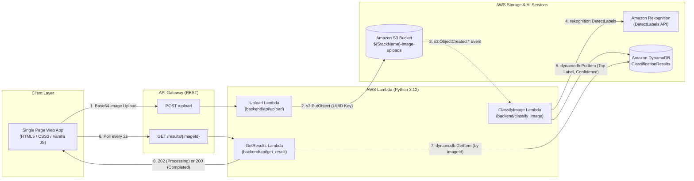
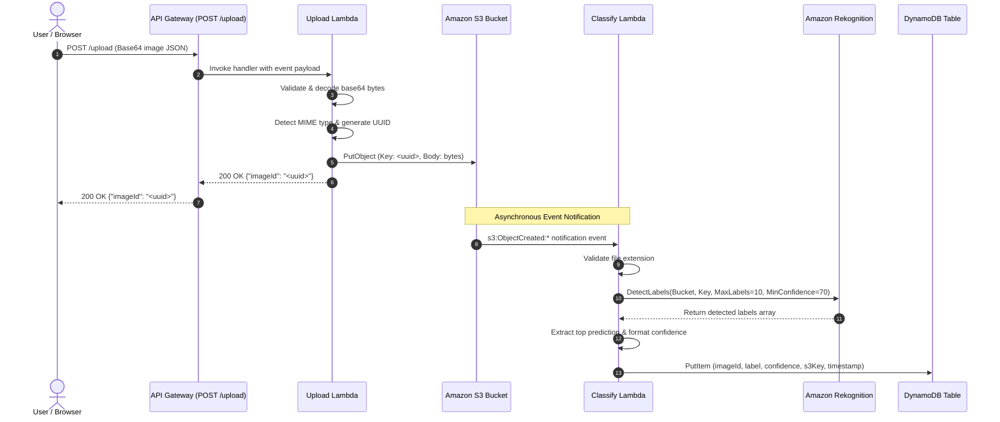
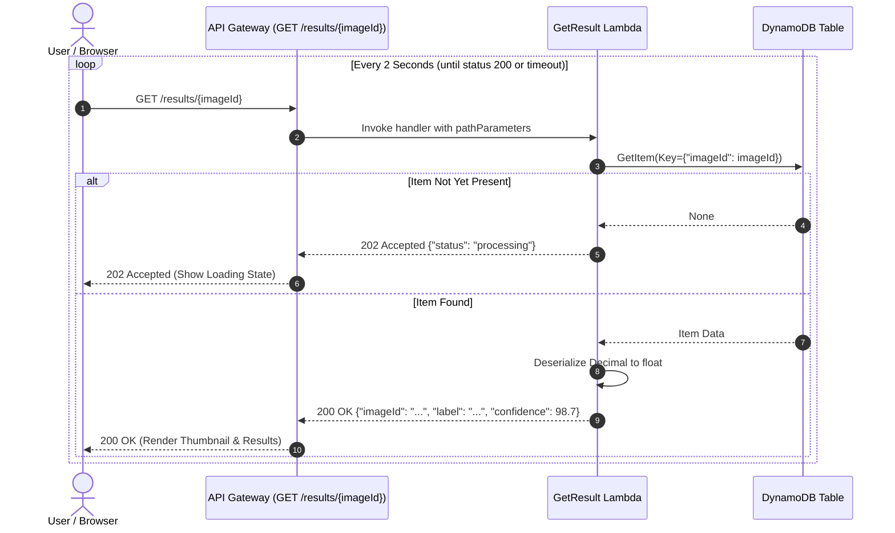

# Serverless Image Classifier — System Architecture

This document provides an in-depth technical overview of the architecture, design principles, security model, and component interactions for the **Serverless Image Classifier** project.

---

## 1. Architectural Overview & Design Principles

The application is built on an **event-driven, decoupled serverless architecture** deployed on AWS. Instead of performing synchronous machine learning inference during the HTTP request lifecycle, the system decouples upload ingestion from image classification to maximize throughput, minimize client latency, and isolate failure domains.

### Key Principles
- **Decoupled Asynchronous Processing**: Client uploads return immediately upon persisting the image to S3; deep learning computer vision inference is triggered asynchronously via S3 event notifications.
- **Stateless Compute**: All business logic executes inside AWS Lambda (Python 3.12 runtimes) with zero servers to provision, patch, or maintain.
- **Least-Privilege Security**: Every Lambda function is bound to an isolated IAM execution role scoped strictly to the AWS resources and actions it requires.
- **Pay-Per-Use Scaling**: Compute, storage, database, and inference scale from zero to high volume with no idle charges.

---

## 2. High-Level Architecture Diagram



---

## 3. Sequence & Data Flow Workflows

### 3.1 Ingestion and Classification Pipeline



### 3.2 Polling and Result Retrieval Workflow



---

## 4. Component Deep Dive

### 4.1 Frontend Single-Page Application (`/frontend`)
- **Structure**: Vanilla HTML5, CSS3, and modern JavaScript without heavy dependencies or bundle steps.
- **Theme**: Crisp White & Blue visual hierarchy using tailored HSL color tokens, soft radial backgrounds, and glassmorphic elevated cards.
- **Interaction**: Full drag-and-drop listener suite (`dragover`, `dragleave`, `drop`) and file picker fallback.
- **State Machine**:
  - `idle`: Dropzone active, waiting for user input.
  - `uploading`: Base64 conversion and transmission to API Gateway.
  - `processing`: Polling loop active (every 2,000ms) with dual-ring spinner and animated progress bar.
  - `completed`: Results grid active with original thumbnail, top predicted label, and animated confidence meter.
  - `error`: User-friendly alert banner with actionable guidance.

### 4.2 API Gateway REST API (`ImageClassifierApi`)
- **Stage**: `dev`.
- **CORS Support**: Configured at both API Gateway (handling `OPTIONS` preflight requests with allowed headers and origin) and in individual Lambda proxy responses (`Access-Control-Allow-Origin: *`).
- **Endpoints**:
  - `POST /upload`: Proxied to `UploadFunction`.
  - `GET /results/{imageId}`: Proxied to `GetResultsFunction`.

### 4.3 Upload Handler (`UploadFunction`)
- **Source**: `backend/api/upload/app.py`.
- **Runtime**: Python 3.12.
- **Responsibilities**:
  - Accepts base64 encoded payload in JSON (`{"image": "..."}`), Data URI (`data:image/jpeg;base64,...`), or raw base64.
  - Validates image binary integrity and checks magic bytes to detect MIME types (`image/jpeg`, `image/png`, `image/webp`).
  - Generates a UUID v4 string for the image identifier.
  - Writes the binary object to S3 under `s3://${BUCKET_NAME}/${imageId}`.
  - Returns HTTP 200 with `{ "imageId": imageId, "message": "Image uploaded successfully" }`.

### 4.4 S3 Bucket (`ImageUploadBucket`)
- **Name**: `${AWS::StackName}-image-uploads`.
- **Configuration**:
  - CORS configuration enabling `PUT` and `POST` methods from browser origins.
  - Configured with event notifications delivering `s3:ObjectCreated:*` events directly to `ClassifyImageFunction`.

### 4.5 Classification Handler (`ClassifyImageFunction`)
- **Source**: `backend/classify_image/app.py`.
- **Runtime**: Python 3.12.
- **Trigger**: S3 `ObjectCreated` notification.
- **Responsibilities**:
  - Parses event records and extracts the target S3 bucket and object key.
  - Invokes Rekognition `DetectLabels` with `MaxLabels=10` and `MinConfidence=70.0`.
  - Selects the top prediction based on highest confidence score.
  - Formats confidence score as a Decimal rounded to 2 decimal places.
  - Persists record to DynamoDB:
    ```json
    {
      "imageId": "<uuid>",
      "label": "Golden Retriever",
      "confidence": 98.7,
      "s3Key": "<uuid>",
      "timestamp": "2026-09-22T10:05:47.850126+00:00"
    }
    ```

### 4.6 DynamoDB Results Table (`ClassificationResultsTable`)
- **Table Name**: `ClassificationResults`.
- **Billing Mode**: `PAY_PER_REQUEST` (On-Demand capacity).
- **Schema**:
  - Partition Key (HASH): `imageId` (String).
- **Attributes**: `imageId`, `label`, `confidence`, `s3Key`, `timestamp`.

### 4.7 Result Retrieval Handler (`GetResultsFunction`)
- **Source**: `backend/api/get_result/app.py`.
- **Runtime**: Python 3.12.
- **Responsibilities**:
  - Extracts `imageId` from path parameters.
  - Executes `GetItem` against DynamoDB table.
  - Handles Python `Decimal` serialization converting DynamoDB numeric types into JSON floats.
  - If found: returns HTTP 200 with classification details.
  - If not found: returns HTTP 202 Accepted with `{"status": "processing", "imageId": imageId}`.

---

## 5. Security & IAM Least-Privilege Model

Each Lambda function operates with a dedicated execution role following the principle of least privilege:

| Function | Granted IAM Actions | Resource Scope |
| :--- | :--- | :--- |
| **UploadFunction** | `s3:PutObject` | `arn:aws:s3:::${ImageUploadBucket}/*` |
| **ClassifyImageFunction** | `s3:GetObject` | `arn:aws:s3:::${StackName}-image-uploads/*` |
| | `rekognition:DetectLabels` | `*` (Rekognition requires `*` for DetectLabels) |
| | `dynamodb:PutItem`, `dynamodb:UpdateItem` | `arn:aws:dynamodb:...:table/ClassificationResults` |
| **GetResultsFunction** | `dynamodb:GetItem`, `dynamodb:BatchGetItem`, `dynamodb:Query` | `arn:aws:dynamodb:...:table/ClassificationResults` |

---

## 6. Error Handling & Edge Cases

1. **Unsupported File Formats**:
   - The classification handler inspects file extensions and ignores non-image files (e.g. `.csv`, `.txt`) with structured warning logs rather than crashing or throwing retry storms.
2. **Empty or Corrupted Payloads**:
   - The upload handler performs base64 decoding with `validate=True` and returns HTTP 400 with a descriptive error message if bytes are empty or corrupt.
3. **Rekognition Service Errors**:
   - ClientErrors (e.g., throttling or internal errors) are caught, logged in JSON format, and re-raised so AWS Lambda's asynchronous retry policy can re-attempt processing.
4. **DynamoDB Serialization**:
   - Standard Python `json.dumps()` fails when serializing `boto3` `Decimal` objects. The `get_result` handler includes a recursive serializer that transforms `Decimal` into Python `float` or `int`.

---

## 7. Cost & Scalability Considerations

- **Zero Idle Costs**: When no requests are made, costs are $0.00 (DynamoDB On-Demand billing, Lambda pay-per-invocation, S3 storage pennies per GB).
- **Concurrency**: Lambda and DynamoDB automatically scale to handle bursts of concurrent uploads without provisioning EC2 instances or maintaining database connections.
- **Teardown**: When no longer needed, running `./scripts/destroy.sh` completely removes the stack and empties the S3 bucket to ensure zero residual charges.
